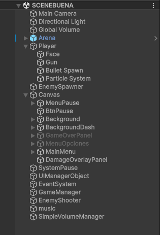
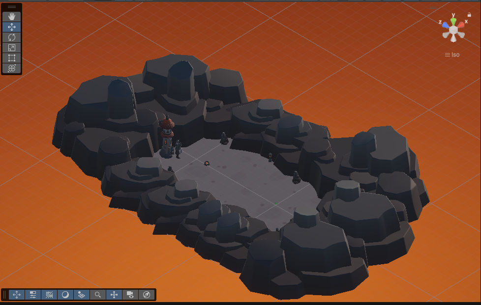
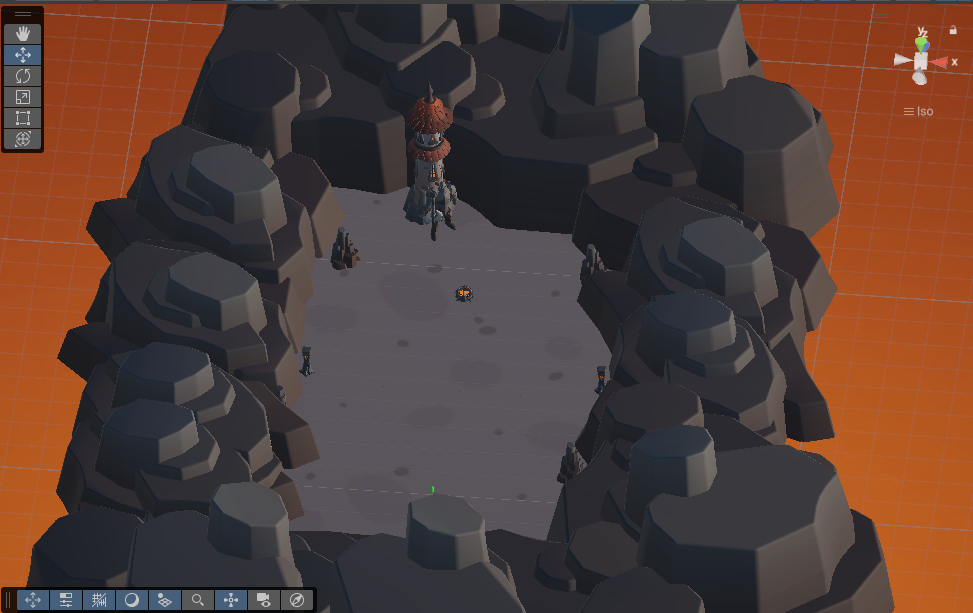
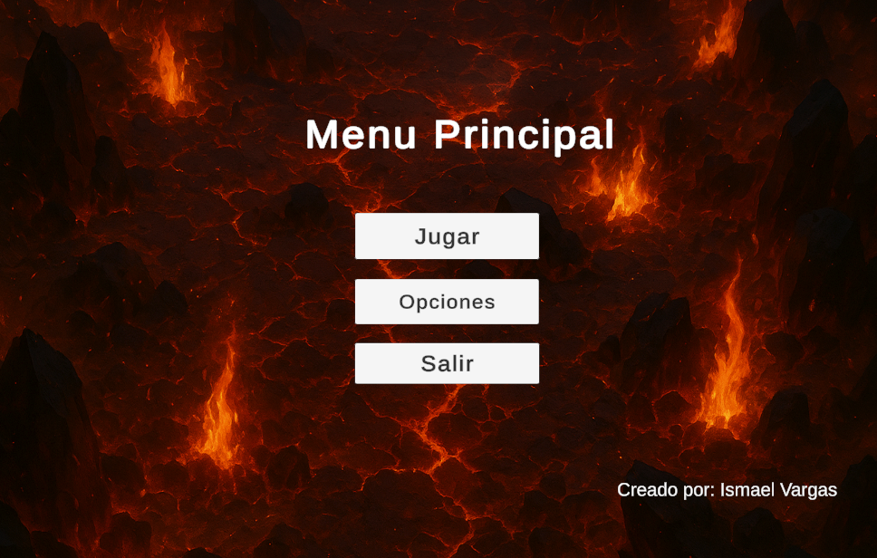
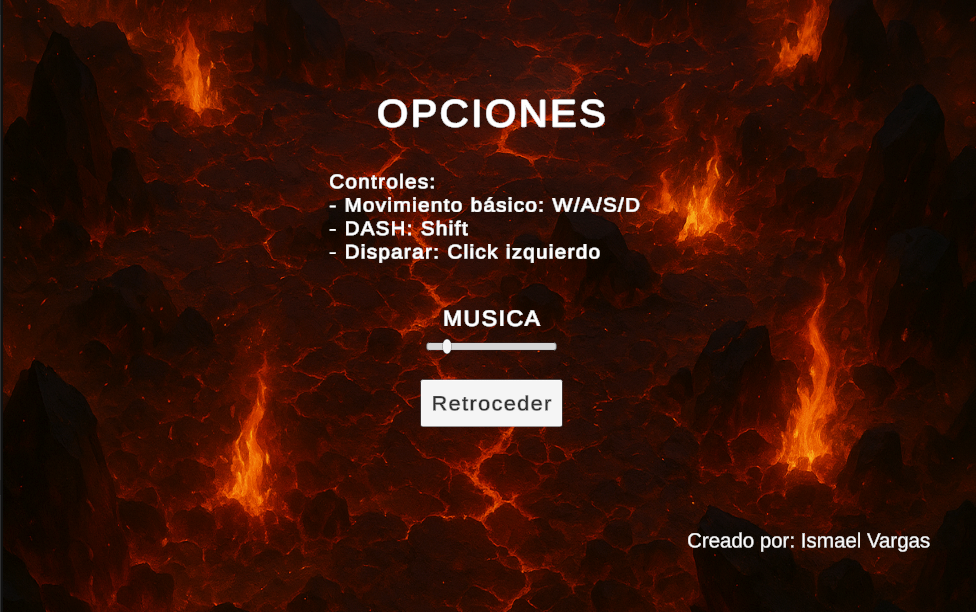

# TopDownArenaGame

¡Bienvenido al repositorio de **TopDownArenaGame**!  
Este es un juego de acción **top‑down** de ritmo rápido ambientado en una arena, donde la **supervivencia** y la **habilidad** son clave.

---

## 🔗 Descarga del Juego

El juego completo **no se incluye** dentro de este repositorio.  
Puedes descargar la última versión ejecutable desde el siguiente enlace de Google Drive:

👉 **[Descargar TopDownArenaGame (Google Drive)](https://drive.google.com/drive/folders/129EZn1P5Xh1N2QNFpG2frk5kK_efjzxo?usp=sharing)**

---

## 🕹️ Controles

| Acción         | Control              | Descripción                                      |
|----------------|----------------------|--------------------------------------------------|
| Movimiento     | `W`, `A`, `S`, `D`   | Mueve al personaje en la dirección deseada.      |
| Disparo        | Clic izquierdo       | Dispara el arma principal.                       |
| Dash / Evasión | Shift izquierdo      | Realiza una esquiva rápida para evitar daño.     |
| Pausa          | ESC                  | Abre el menú de pausa.                           |

---

## 🚀 Cómo Ejecutar el Juego (Windows)

1. **Descarga** el archivo ZIP desde el enlace de Google Drive.  
2. **Descomprime** el ZIP en la carpeta que prefieras.  
3. **Navega** a la carpeta del juego:

```
TopDownArenaGame/Game
```

4. **Ejecuta** el archivo:

```
TopDownArenaGame.exe
```

¡Y listo! El juego iniciará inmediatamente.

---

## 🎨 Multimedia (Capturas + Video)

### 📸 Capturas del Juego

Estas imágenes están ubicadas en la carpeta `screenshots/` del repositorio:







### 🎥 Video de Gameplay

👉 **Video de Gameplay:** *([CLICK PARA VER EL VIDEO](https://youtu.be/jO0fBjXE16I?si=tGFb6c-O_duoC2ea))*

---

## ⚙️ Estructura del Proyecto y Decisiones de Desarrollo

El juego se ha desarrollado con un enfoque simple, eficiente y centralizado utilizando una única escena principal.

### 🧩 Escena Única (`SCENEBUENA`)

- Minimiza tiempos de carga  
- Simplifica comunicación entre sistemas  
- Facilita mantenimiento y depuración

### 🛠️ Sistemas Principales

- **GameManager**, **SystemPause**, **UIManagerObject**
- **EnemySpawner**, **EnemyShooter**
- **SimpleVolumeManager**, **music**
- **Canvas** con menús: MainMenu, MenuPause, MenuOpciones, GameOverPanel, etc.

### 👾 Enemigos

**En el juego hay dos tipos de enemigos principales:**

- Enemigo perseguidor:

Se mueve intentando alcanzar al jugador y representa la amenaza básica de contacto.

Su IA está diseñada para seguir al jugador por la arena y forzar maniobras evasivas.

- Bombas que caen:

Aparecen cayendo desde el aire o como objetos que impactan en la arena.

Tienen un temporizador de 2 segundos desde su aparición hasta la explosión.

El jugador dispone de ese tiempo para moverse fuera del radio de la explosión o esquivarlas con dash.

### 🧠 Razón de la arquitectura

- **Centralización**: todo ocurre en una escena  
- **Modularidad**: muchos scripts pequeños  
- **Escalabilidad**: más fácil añadir contenido sin romper sistemas existentes  

---

## 🛠️ Tecnologías Usadas

- Motor: **Unity**
- Lenguaje: **C#**

---

¡Gracias por revisar el proyecto! Si tienes sugerencias o encuentras algún error, puedes abrir un issue. 🎮
